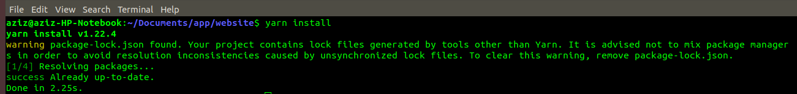

# Procedures and code quality standards for the MOTI developers

## To start working on this application follow these steps:

### 1. First clone the latest code from the github repository

> git clone https://github.com/themoticom/website.git

and then you have the website folder on your local machine.

### 2. Go inside the website folder by typing this command

> cd website

### 3. To Install Dependencies, use this command:

> npm install

# IMPORTANT: Put the .env file in the app root directory

### 4. To start the application in Development Mode using this command:

> npm run dev

**Now your app is running on** http://localhost:3000/

## Style Rules for Good Coding

### 1. Readability!

Good code is written to be easily understood by colleagues. It is properly and consistently formatted and uses clear, meaningful names for functions and variables. Concise and accurate comments describe a natural decomposition of the software’s functionality into simple and specific functions. All tricky sections are clearly noted. It is easy to see why the program will work and all reasons that it works in all conceivable cases.

### 2. Maintainability!

Code is written so that it is straightforward for another programmer to fix bugs or make changes to its functionality later. Functions are general and assume as little as possible about preconditions. All important values are marked as constants, which allows them to be easily changed throughout the application. Code is robust and can handle any possible input and produce the expected result without crashing. Clear messages are output for input which is not allowed.

### 3. Comments!

Comments help make computer programs readable to humans. Comments explain clearly everything about a program which is not obvious to a peer programmer. The volume of comments written is not important, but the quality is.
When commenting, please follow these rules:
Block Comments are written using the /_ comments _/ style.
Block Comments are added:

**A.** at the top of every source file and include:

- your name
- the date your code was written
- an overall description of the purpose of that program.

**B.** before functions with a description of the function’s purpose; these can be omitted for very short, obvious functions only.

**C.** inline, as //comments. Near important lines of code within functions and with variables when they are initialized

### 4. Naming!

Names given to classes, variables, and functions are unambiguous and descriptive.

Other guidelines for naming are:

- Capitalization is used to separate multi-word names: StoneMasonKarel.
- The first letter of a class name is always capitalized: GraphicsProgram
- The first letter of a function or variable name is always in lowercase: setFilled().
- The names x and y are only used to describe coordinates.
- The names i, j, and k are only used as variables in for loops.
- Other one-letter names are avoided: area = base _ height instead of a = b _ h.
- Names of constants are capitalized, with underscores to separate words: BRICK_COLOR.
- Use abbreviations with caution. For instance: “max” instead of “maximum” is fine, but “xprd” instead of “crossProduct” is not.

Names given to Components and the files that hold them should always be in PascalCase.

### 5. Indentation!

Indentation is used to clearly mark control flow in a program. Within any bracketed block, all code is indented in one tab. This includes the class body itself. Each additional for, while, if, or switch structure introduces a new block which is indented, even if brackets are omitted for one line statements. For if statements, any corresponding else statements line up

### 6. White Space!

White space is meaningless to compilers, but are used consistently to improve readability. Typically three blank lines are left in between functions. Individual blank lines are used within functions to separate key sections. The use of spaces varies as well, but inserting one space usually make expression more readable; next = 7 _ (prev – 1) is clear than next=7_(prev-1).

### 7. Function Usage!

Functions are short and accomplish a clear, specific task. As much as possible they are considered “black boxes” which do not depend on anything except their parameters and can handle any possible input gracefully. A common rule of thumb is the “Ten Line Rule”; usually functions longer than ten lines are trying to do too much and are tof be simplified. Functions do not have any repeated segments of code. Rather than repeating segments, a separate function is created. This will shorten your program and improve readability.

## Other guidelines

- Use npm, not yarn
- Use Visual Studio Code and install the esline extension as well as the prettier extension in their default configuration. Always follow the eslint recommendations.
- Make sure you use ample Commenting throughout your code
- Images are 1024x1024 and do not exceed 300kb for better website speed and to save database cost
- Keep code files small and divide code into components
- Always test your code before pushing it to github
- Avoid touching a teammate’s code unless with specific instructions or permission
